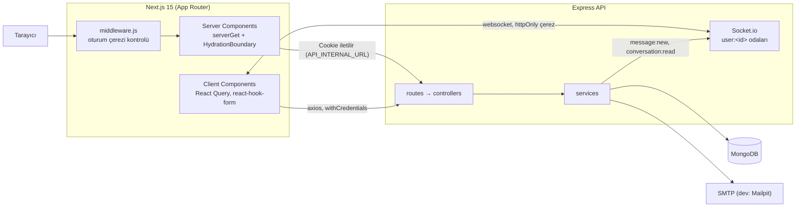
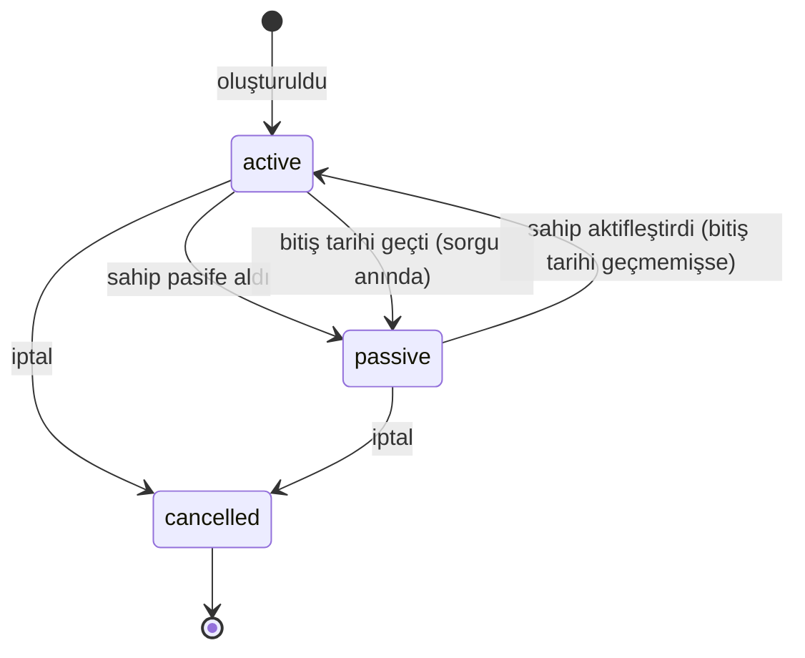
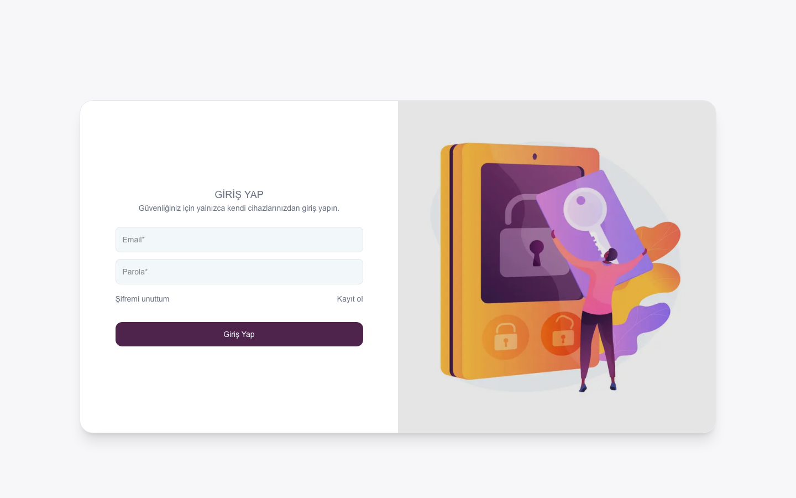
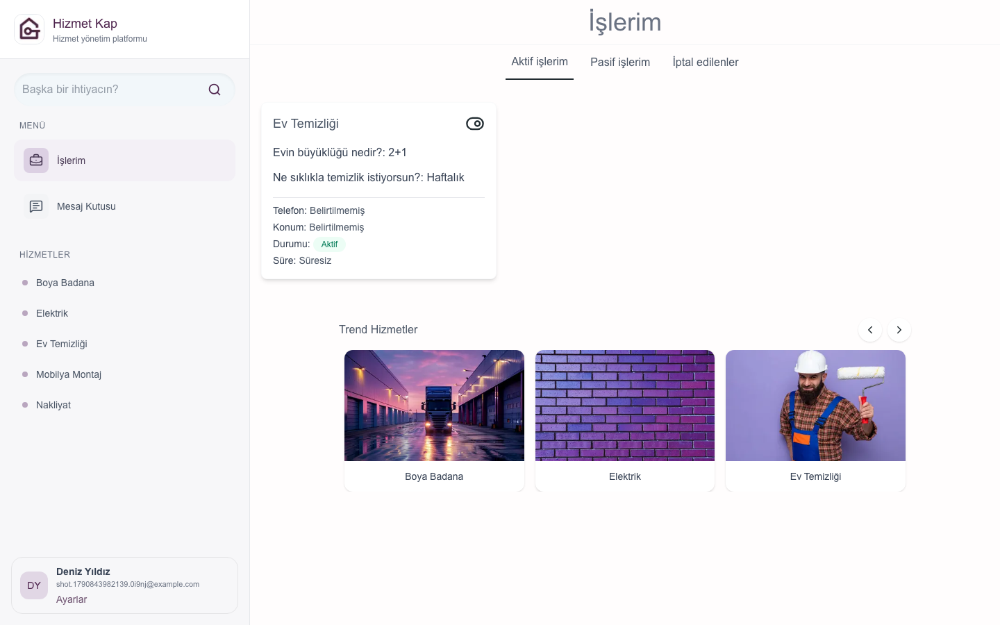
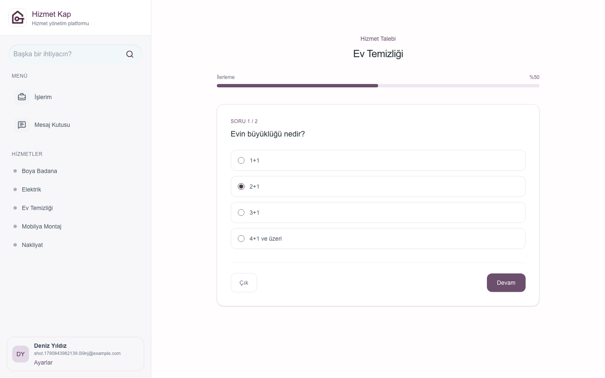
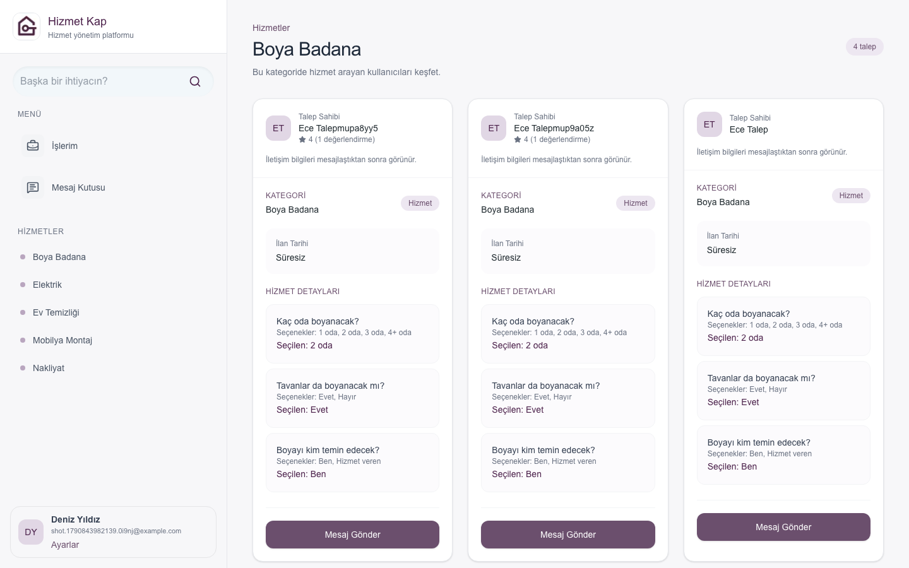
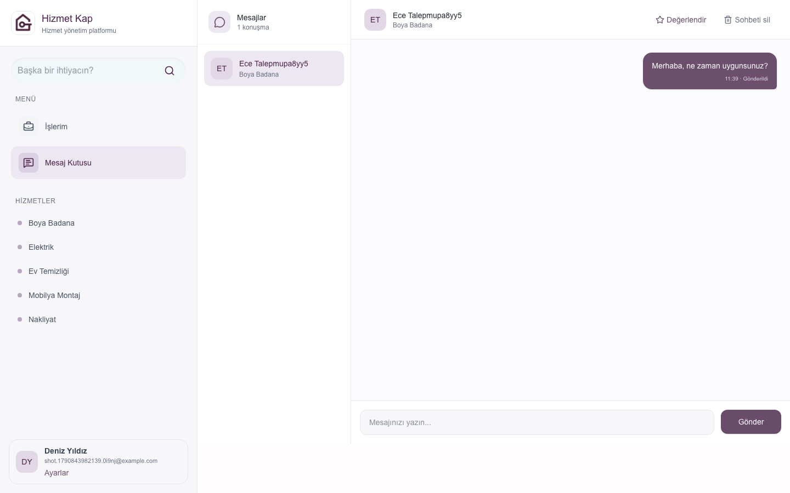
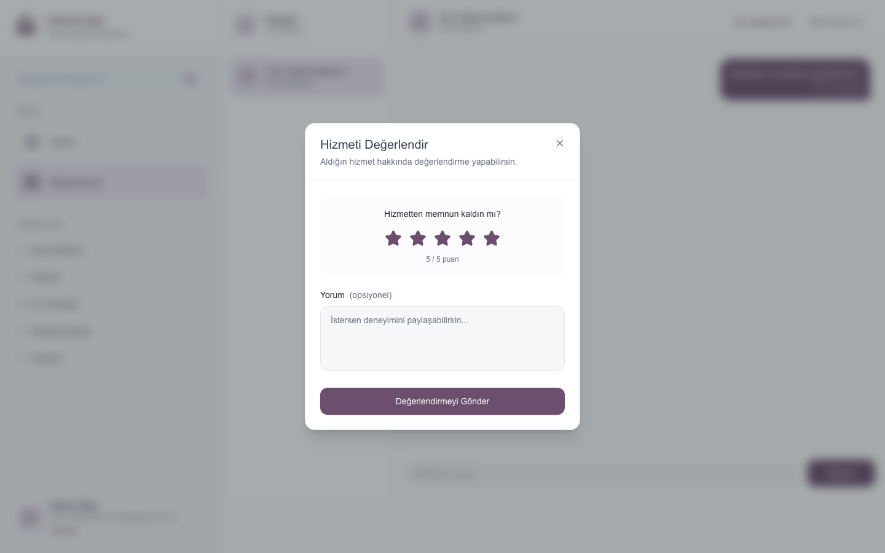

# Hizmet Kap

Hizmet Kap, ihtiyaç sahiplerinin kategori bazlı adım adım hizmet talebi (tadilat, temizlik, nakliyat vb.) oluşturduğu; hizmet verenlerin bu talepleri görüp talep sahibiyle gerçek zamanlı mesajlaştığı ve aldıkları hizmeti değerlendirebildiği bir web uygulamasıdır.

## Problem

Küçük ölçekli hizmet ihtiyaçları genellikle telefon trafiği ve dağınık mesajlarla yürür. Hizmet Kap ihtiyacı yapılandırılmış sorularla toplar, iletişim bilgisini yalnızca gerçekten iletişime geçen kişiyle paylaşır ve süreci tek bir yerde tutar.

## Kullanıcı akışı

1. Kullanıcı kayıt olur ve e-posta/parola ile giriş yapar.
2. Kenar çubuğundan veya "Trend Hizmetler" listesinden bir kategori seçer.
3. Kategorinin şablonundaki soruları adım adım cevaplayarak talep oluşturur; her adım ayrı doğrulanır.
4. Talep detayında telefon, konum (tarayıcı konumu) ve bitiş tarihi ekleyebilir.
5. "İşlerim" ekranında taleplerini aktif / pasif / iptal sekmelerinde görür, aktif ↔ pasif arasında geçiş yapar.
6. Hizmet verenler kategori sayfasında başkalarının aktif taleplerini görür ve "Mesaj Gönder" ile talep sahibine yazar.
7. Mesajlar Socket.io ile anlık iletilir; okunmamış sayısı ve okundu bilgisi tutulur.
8. Mesajlaşan kullanıcılar birbirini değerlendirir; ortalama puan profilde görünür.
9. Kullanıcı hesabını dondurabilir (girişte yeniden aktifleşir) veya parolasıyla kalıcı olarak silebilir.

## Roller

| Rol | Yetkiler |
| --- | --- |
| `user` | Kendi profilini, taleplerini ve dahil olduğu konuşmaları görür/değiştirir. Başkalarının aktif taleplerini iletişim bilgisi olmadan listeler. |
| `admin` | Kategori ve talep şablonu oluşturur/düzenler/siler, kullanıcıları listeler, herhangi bir talebin durumunu yönetebilir. |

Kullanıcı kimliği her zaman access token'dan alınır; istek gövdesinden gelen `ownerId`, `senderId`, `role` gibi alanlar doğrulamada reddedilir.

## Mimari



**Backend** (`backend/`): `routes → controllers (ince) → services → models`. Ek katmanlar: `middleware` (auth, validate, rate limit, upload, hata), `validators` (zod), `sockets`, `utils` (AppError, asyncHandler, serializers, pagination), `scripts` (seed, legacy migration).

**Frontend** (`frontend/src/`): `app/` route group'ları (`(auth)`, `(app)`, `(settings)`), `features/<alan>/{api,hooks,components,pages,utils}` (auth, user, category, request, message, review) ve atomic design ile `shared/components/{atoms,molecules,organisms}`.

### Talep yaşam döngüsü



Ayrıntılar: [docs/adr/0003-talep-durum-yonetimi.md](docs/adr/0003-talep-durum-yonetimi.md).

## Teknoloji seçimleri

| Alan | Seçim | Gerekçe |
| --- | --- | --- |
| Frontend | Next.js 15 App Router, React 19 | Server Component ile ilk veri, metadata ve `notFound()`; etkileşimli parçalar client'ta. |
| Sunucu durumu | TanStack Query | Cache, sayfalama (`useInfiniteQuery`), optimistic update ve socket olaylarıyla cache güncelleme. |
| Formlar | react-hook-form + zod | Backend ile aynı doğrulama kuralları, adım bazlı sihirbaz doğrulaması. |
| Stil | Tailwind CSS 4, lucide-react ikonları | MUI/emotion kaldırıldı; tek stil sistemi. Tarih seçimi için yerel `<input type="date">`. |
| Harita | Leaflet, `next/dynamic` ile SSR dışı | Leaflet `window`'a bağımlı. |
| API | Express 4, Mongoose 8 | Mevcut yapı korundu. |
| Doğrulama | zod 4 | Girdi, ortam değişkeni ve OpenAPI dokümanı tek kaynaktan. |
| Gerçek zamanlı | Socket.io | Çerezle doğrulanan handshake, kullanıcı odaları. |
| Log | pino + pino-http | Yapılandırılmış log, `X-Request-Id`, hassas alanların maskelenmesi. |
| Güvenlik | helmet, CORS whitelist, express-rate-limit, express-mongo-sanitize, bcrypt | Ayrıntılar aşağıda. |
| Test | Vitest, Supertest, mongodb-memory-server, Testing Library, MSW, Playwright | |
| Dil | JavaScript (ES Modules) | TypeScript yerine sınırlarda zod + test: [ADR 0006](docs/adr/0006-typescript-yerine-zod-ve-test.md). |

### Güvenlik özeti

- Access token (15 dk) ve refresh token (7 gün, rotation + reuse detection) yalnızca httpOnly çerezlerde; `localStorage`'da kullanıcı veya token tutulmaz. Bkz. [ADR 0001](docs/adr/0001-token-ve-cerez-stratejisi.md).
- `JWT_ACCESS_SECRET` zorunlu ve en az 32 karakter; sabit yedek değer yok.
- Giriş hatası tek tip ("E-posta veya parola hatalı"); parola sıfırlama isteği kullanıcının varlığını sızdırmaz.
- Parola sıfırlama: hash'lenerek saklanan, 30 dakikalık, tek kullanımlık token; bağlantı e-postayla gönderilir.
- Yanıtlar serializer'lardan geçer: parola hash'i hiçbir yanıtta yer almaz; talep listelerinde başkalarının e-posta/telefonu dönmez. İletişim bilgisi yalnızca talep sahibine, admine ve talep sahibiyle mesajlaşmış kullanıcıya gösterilir.
- Avatar yükleme: yalnızca JPG/PNG/WEBP, en fazla 5 MB, dosya imzası (magic bytes) kontrolü, rastgele dosya adı; eski dosya silinir.
- JSON gövde limiti 100 KB; auth uçlarında rate limit; NoSQL operatör enjeksiyonu temizlenir.

## Kurulum

### Docker ile (önerilen)

```bash
docker compose up --build
```

| Servis | Adres |
| --- | --- |
| Uygulama | http://localhost:3000 |
| API | http://localhost:6398 (`/health`, `/api/docs`) |
| Mailpit (parola sıfırlama e-postaları) | http://localhost:8025 |

Backend ilk açılışta veritabanı boşsa örnek verileri yükler (6 kategori + şablon, demo kullanıcılar). Tüm demo hesapların parolası `Demo12345`:

| E-posta | Rol |
| --- | --- |
| `admin@hizmetkap.local` | admin |
| `ayse@hizmetkap.local` | user |
| `mehmet@hizmetkap.local` | user |

Portlar doluysa `FRONTEND_PORT` ve `MAILPIT_UI_PORT` ile değiştirilebilir:

```bash
FRONTEND_PORT=3100 MAILPIT_UI_PORT=8026 docker compose up --build
```

### Yerel geliştirme

Gereksinimler: Node.js 20+, MongoDB 7 ve (opsiyonel) Mailpit.

```bash
cp backend/.env.example backend/.env
cp frontend/.env.example frontend/.env.local
cd backend && npm install && npm run seed && npm run dev
cd frontend && npm install && npm run dev
```

Eksik veya hatalı bir ortam değişkeninde iki uygulama da hangi değişkenin sorunlu olduğunu belirten bir hatayla durur.

### Eski veritabanından geçiş

Önceki sürümün koleksiyonları (`kullanicis`, `kategoris`, `tadilats`, `aktifs`, `messages`) yeni modele şu komutla taşınır:

```bash
cd backend && npm run migrate:legacy
```

Script idempotenttir; aynı `_id`'leri korur, eski koleksiyonları silmez (yalnızca eski `messages` koleksiyonunu `legacy_messages` olarak yeniden adlandırır) ve atlanan kayıtları raporlar. E-postası olmayan "kullanıcı adıyla giriş" hesapları taşınmaz; bu giriş yöntemi kaldırılmıştır.

## Testler

```bash
cd backend && npm test             # Vitest + Supertest + mongodb-memory-server
cd backend && npm run test:coverage
cd frontend && npm test            # Vitest + Testing Library + MSW
cd frontend && npm run test:e2e    # Playwright, çalışan bir stack ister
```

E2E testleri varsayılan olarak `http://localhost:3000` adresine bağlanır; farklı port için `E2E_BASE_URL` kullanılır. Senaryolar: kayıt → giriş → kategori seçimi → adım adım talep → pasife alma/aktifleştirme → ikinci kullanıcıyla mesajlaşma (anlık iletim ve okundu bilgisi) → değerlendirme (ikinci değerlendirme reddedilir) → çıkış; ayrıca oturumsuz erişimin engellenmesi ve JavaScript'ten okunabilir oturum çerezi bulunmaması.

CI (`.github/workflows/ci.yml`) her PR'da backend ve frontend için lint, test ve build; ardından Docker Compose ile E2E çalıştırır.

## Kod kuralları

- ESLint `no-console: error` ve yorum satırı yasağı (yerel `no-comments` kuralı), Prettier.

## API dokümantasyonu

Zod şemalarından üretilen OpenAPI 3.1 dokümanı: `GET /api/openapi.json`, arayüz: `/api/docs`. Dosya olarak dışa aktarmak için `cd backend && npm run openapi`.

## Ekran görüntüleri

| | |
| --- | --- |
|  |  |
|  |  |
|  |  |

## Demo

Herkese açık bir demo ortamı şu an yok; `docker compose up --build` ile yerelde tüm sistem ayağa kalkar.

## Diğer dokümanlar

- [Deploy](docs/deploy.md)
- [Performans ölçümleri](docs/performance.md)

## Karar kayıtları

- [0001 — Token ve çerez stratejisi](docs/adr/0001-token-ve-cerez-stratejisi.md)
- [0002 — Server Component ile ayrı Express API](docs/adr/0002-server-component-ve-express-api.md)
- [0003 — Talep durum yönetimi](docs/adr/0003-talep-durum-yonetimi.md)
- [0004 — Değerlendirme modeli](docs/adr/0004-degerlendirme-modeli.md)
- [0005 — Socket oda yapısı ve mesaj akışı](docs/adr/0005-socket-oda-yapisi.md)
- [0006 — TypeScript yerine zod ve test](docs/adr/0006-typescript-yerine-zod-ve-test.md)
